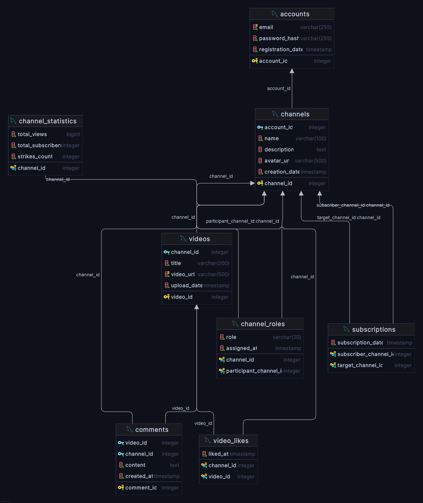

# 🗄️ Проектирование БД: Видеоплатформа
> **Лабораторная работа №1** • Проектирование реляционной базы данных, построение ER-модели и нормализация.

---

## 1. Концептуальная модель данных (ER-модель)

Предметная область разделена на следующие ключевые сущности:
- **`Account` (Аккаунт)** — основа платформы, содержит авторизационные данные и дату регистрации.
- **`Channel` (Канал)** — профиль автора или зрителя (название, описание, аватар).
- **`Video` (Видео)** — контент, загружаемый от имени канала.
- **`Comment` (Комментарий)** — текстовое сообщение, оставляемое каналом под конкретным видео.

### Типы связей:
- **1:1** | `Channel` -> `Channel_Statistics` (один канал — один набор статистики).
- **1:M** | `Account` ↔ `Channel` (один аккаунт — множество каналов).
- **1:M** | `Channel` ↔ `Video` (один канал — множество видео).
- **1:M** | `Channel` ↔ `Comment` / `Video` ↔ `Commgit push origin mainent`.
- **M:N** | `Channel` ↔ `Channel` (подписки).
- **M:N** | `Channel` ↔ `Video` (лайки).
- **M:N** | `Channel` ↔ `Channel` с атрибутом (роли: *creator, moderator, user*).

   
  <em>Рис. 1. Схема базы данных видеоплатформы (ER-модель)</em>

---

## 2. Реляционная схема и нормализация

Спроектированная база данных нормализована до **Третьей нормальной формы (3НФ)**:
1. **1НФ:** Атрибуты атомарны (массивы вынесены в отдельные таблицы, например, `channel_roles`).
2. **2НФ:** В таблицах с составным ключом (`subscriptions`, `video_likes`) неключевые атрибуты зависят от ключа целиком.
3. **3НФ:** Отсутствуют транзитивные зависимости.

Ограничения целостности (`UNIQUE`, `CHECK`, `NOT NULL`) и внешние ключи реализованы средствами PostgreSQL.

👉 **[Смотреть исходный DDL-скрипт (init.sql)](src/init.sql)**

---

## 3. Операции реляционной алгебры

Реляционная алгебра — это теоретическая основа баз данных. Ниже приведены 5 базовых операций на примере спроектированной БД, записанные в текстовом алгебраическом формате.

### 1. Проекция (Projection)
Работает как вертикальный фильтр, отсекая лишние столбцы и оставляя только указанные.
* **Пример:** Получить из таблицы видео только список их названий и ссылок.
* **Операция:** `ПРОЕКЦИЯ [title, video_url] (videos)`
* **В SQL:** `SELECT title, video_url FROM videos;`

### 2. Селекция / Выборка (Selection)
Работает как горизонтальный фильтр, отбирая только те строки, которые удовлетворяют условию.
* **Пример:** Найти в таблице ролей только те записи, где участник является создателем канала.
* **Операция:** `ВЫБОРКА [role = 'creator'] (channel_roles)`
* **В SQL:** `SELECT * FROM channel_roles WHERE role = 'creator';`

### 3. Естественное соединение (Natural Join)
Связывает (склеивает) две разные таблицы в одну новую на основе совпадающих внешних ключей.
* **Пример:** Объединить каналы с их аккаунтами, чтобы увидеть email владельца каждого канала.
* **Операция:** `СОЕДИНЕНИЕ (channels, accounts) ПО channels.account_id = accounts.account_id`
* **В SQL:** `SELECT * FROM channels JOIN accounts ON channels.account_id = accounts.account_id;`

### 4. Объединение (Union)
Математическое сложение двух множеств с автоматическим удалением дубликатов.
* **Пример:** Собрать ID всех каналов, которые проявляли активность — либо ставили лайк, либо писали комментарий.
* **Операция:** `ОБЪЕДИНЕНИЕ ( ПРОЕКЦИЯ [channel_id] (video_likes), ПРОЕКЦИЯ [channel_id] (comments) )`
* **В SQL:** `SELECT channel_id FROM video_likes UNION SELECT channel_id FROM comments;`

### 5. Разность (Difference)
Вычитание одного множества из другого (оставляет элементы первого множества, которых нет во втором).
* **Пример:** Найти «пустые» каналы, вычтя из всех существующих каналов те, которые уже публиковали видео.
* **Операция:** `РАЗНОСТЬ ( ПРОЕКЦИЯ [channel_id] (channels), ПРОЕКЦИЯ [channel_id] (videos) )`
* **В SQL:** `SELECT channel_id FROM channels EXCEPT SELECT channel_id FROM videos;`
